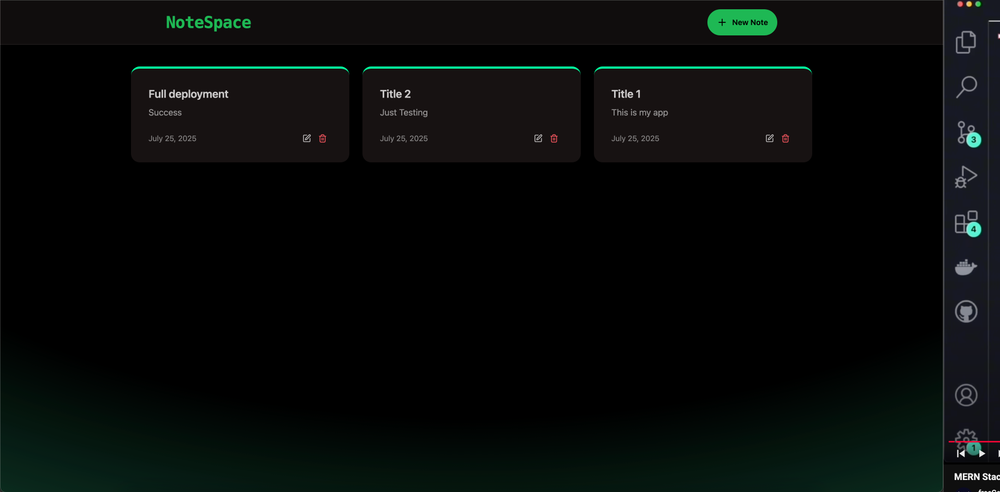
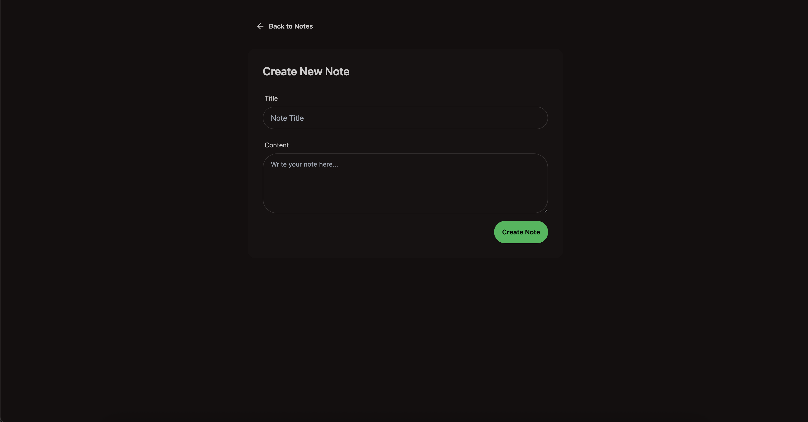
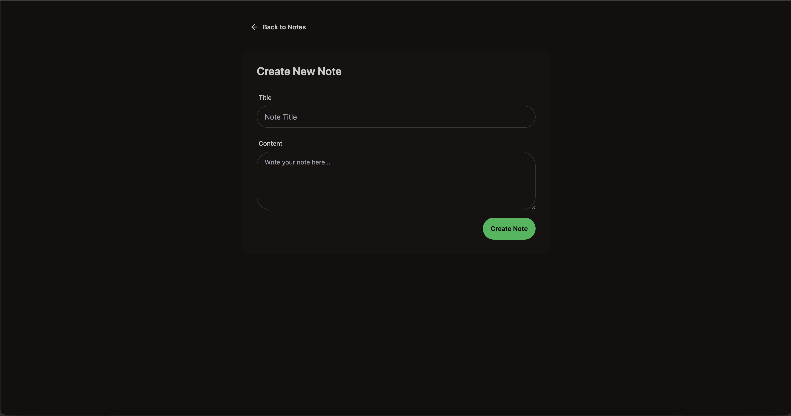

# NoteSpace

A modern, full-stack MERN notes app for creating, editing, and managing your notes with a beautiful UI and robust backend.

---

## 🚀 Features

- Create, view, edit, and delete notes
- Real-time feedback and error handling
- Rate limiting to prevent abuse (10 requests per 20 seconds)
- Responsive, modern UI (React + Tailwind CSS + DaisyUI)
- RESTful API (Express + MongoDB)

---

## 🛠️ Tech Stack

- **Frontend:** React, Vite, Tailwind CSS, DaisyUI, Axios, React Router, React Hot Toast
- **Backend:** Node.js, Express, MongoDB (Mongoose), Upstash Redis (rate limiting)
- **Other:** dotenv, CORS

---

## 📝 .env Setup

### Backend (`/backend`)

```env
MONGO_URI=<your_mongo_uri>
UPSTASH_REDIS_REST_URL=<your_redis_rest_url>
UPSTASH_REDIS_REST_TOKEN=<your_redis_rest_token>
NODE_ENV=development
```

---

## 🏃‍♂️ Run the Backend

```bash
cd backend
npm install
npm run dev
```

---

## 💻 Run the Frontend

```bash
cd frontend
npm install
npm run dev
```

---

## 📸 Screenshots

### Home Page


_Displays all notes in a responsive grid layout._

### Create Note Page


_Form for adding a new note with title and content fields._

### Note Details Page


_View, edit, or delete a specific note._

---
